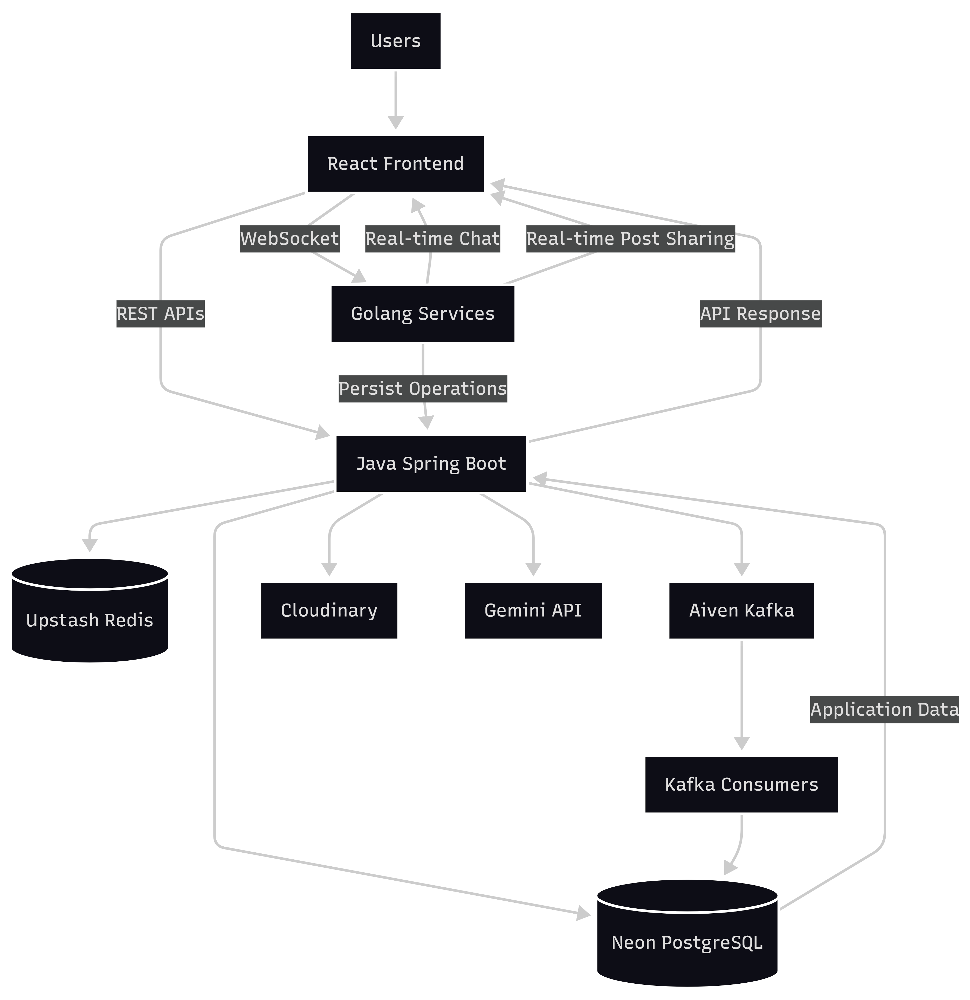
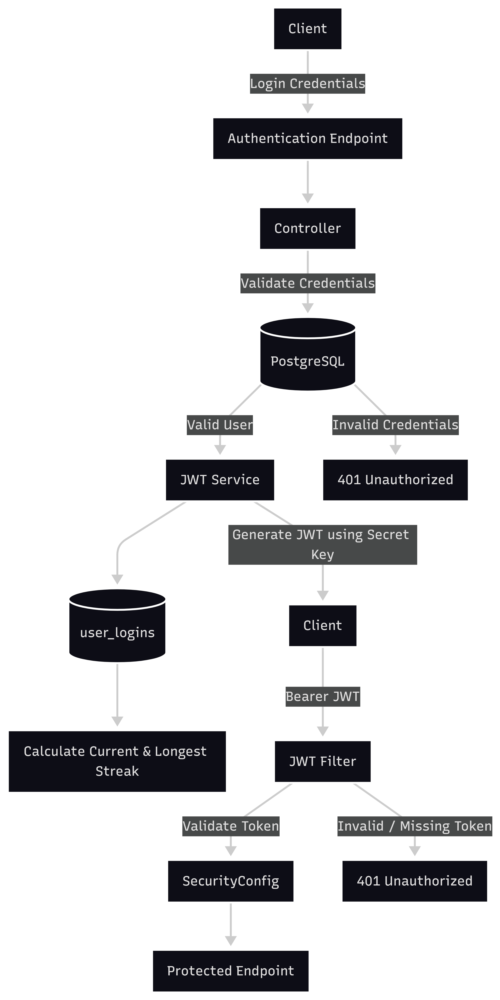
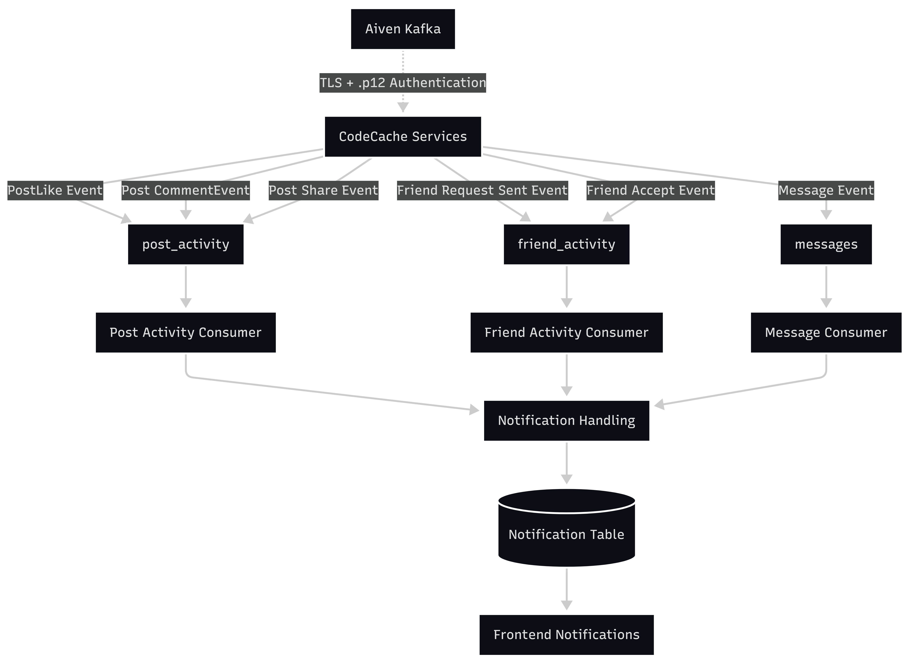
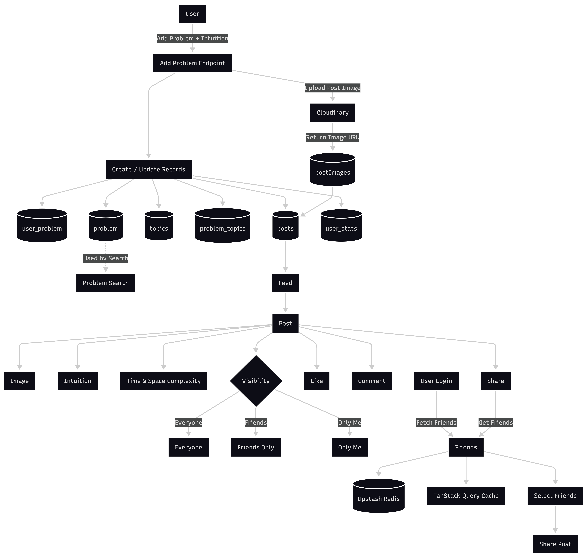
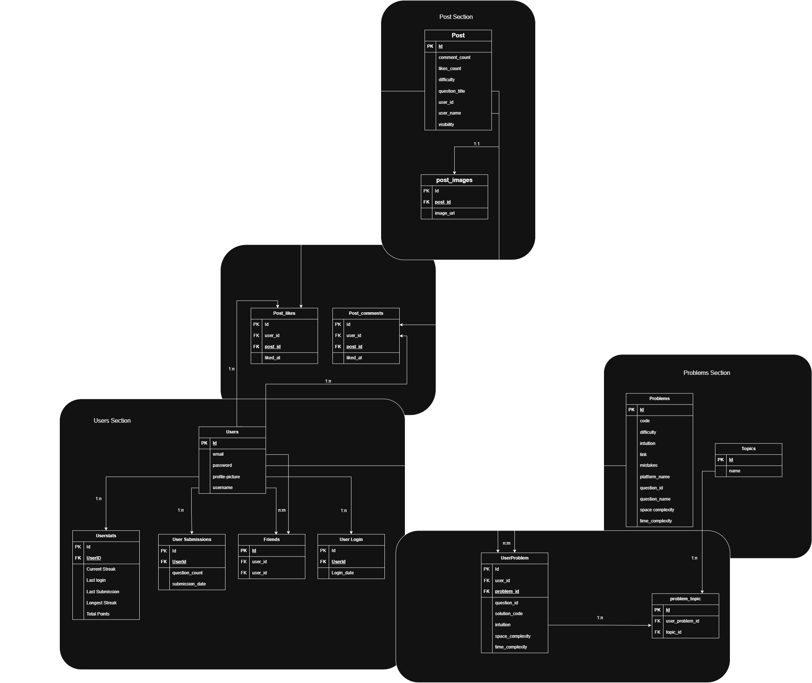

<div align="center">

# CodeCache

### A Social Coding Platform for Developers

**Build · Solve · Share · Connect**

<br/>

[](https://www.oracle.com/java/)
[](https://spring.io/projects/spring-boot)
[](https://react.dev/)
[](https://www.postgresql.org/)
[](https://www.docker.com/)

<br/>

[**Live Demo**](https://adorable-basbousa-4829bb.netlify.app/)
  •  
[**Backend**](https://github.com/pavan-ganesh123/CodeCache)
  •  
[**Frontend**](https://github.com/pavan-ganesh123/CodingFront)
  •  
[**Go Service**](https://github.com/pavan-ganesh123/ChatLoop)

</div>

---

## Overview

**CodeCache** is a full-stack social coding platform designed to combine
programming practice with developer interaction.

Users can discover coding problems, track their progress, share problems
and solutions, connect with other developers, chat with friends, and
receive notifications.

The project evolved from a backend-focused application into a
**multi-service product-oriented system** using Spring Boot, React, Go,
Python, PostgreSQL, Redis, Kafka, and external services.

---

## What Can You Do With CodeCache?

| Area               | Features                                                       |
| ------------------ | -------------------------------------------------------------- |
| **Authentication** | Login, authentication, authorization, protected resources      |
| **Problems**       | Coding problems, platforms, difficulty, intuition & complexity |
| **Topics**         | Organize problems using topics                                 |
| **Posts**          | Share coding problems and solutions                            |
| **Interactions**   | Likes, comments and post sharing                               |
| **Social**         | Friend requests, relationships, blocking                       |
| **Feed**           | Personalized feed with visibility rules and pagination         |
| **Chat**           | Friend-to-friend conversations and persistent messages         |
| **Notifications**  | Event-driven notifications using Kafka                         |
| **Media**          | Profile and post image uploads                                 |
| **Profile**        | Coding activity, streaks and statistics                        |

---

## System Architecture

CodeCache follows a multi-service architecture where the React frontend
communicates primarily with the Spring Boot backend.

The backend interacts with PostgreSQL for persistent data, Redis for
fast-access data, Kafka for asynchronous event communication, and
additional Go and Python services for specialized functionality.

<p align="center">
  
</p>

---

## Authentication Flow

Authentication is handled by the Spring Boot backend using token-based
authentication.

The flow covers login, token generation, request authentication, and
access to protected resources.

**Login → Authentication → Token Generation → Request Authentication → Protected Resources**

<p align="center">
  
</p>

---

## Event-Driven Notifications

CodeCache uses **Apache Kafka** for asynchronous event communication.

Relevant application events are published by the Spring Boot backend to
Kafka and consumed asynchronously for notification processing.

**Application Event → Kafka Producer → Kafka Topic → Consumer → Notification Processing**

<p align="center">
  
</p>

> Kafka infrastructure used during development was hosted through Aiven.

---

## Feed

The feed combines posts with user relationships and post visibility
rules.

Posts support three visibility levels:

```text
PUBLIC
FRIENDS
PRIVATE
```

The feed also uses pagination to avoid loading the entire dataset at
once.

<p align="center">
  
</p>

---

## Database Design

**PostgreSQL** is the primary persistent database.

The schema models users, coding problems, user-problem relationships,
posts, likes, comments, friendships, conversations, messages,
notifications, topics, and their relationships.

The project uses relational concepts including:

* Primary and foreign keys
* Unique constraints
* One-to-many relationships
* Many-to-many relationships
* Mapping tables
* Pagination
* Lazy fetching where appropriate

<p align="center">
  
</p>

---

## Technology Stack

### Application

| Layer              | Technologies      |
| ------------------ | ----------------- |
| Frontend           | React             |
| Primary Backend    | Java, Spring Boot |
| Additional Backend | Go                |
| Additional Service | Python            |
| API                | REST, GraphQL     |
| ORM                | JPA, Hibernate    |

### Infrastructure

| Component        | Technology           |
| ---------------- | -------------------- |
| Database         | PostgreSQL / Neon    |
| Cache            | Redis / Upstash      |
| Messaging        | Apache Kafka / Aiven |
| Image Storage    | Cloudinary           |
| Containerization | Docker               |
| Deployment       | Render               |

---

## Python Service

CodeCache also includes a Python service responsible for interacting with
coding platforms.

The service currently supports:

* Fetching code from **LeetCode**
* Fetching all submissions from **LeetCode**
* Fetching submission details from **LeetCode**
* Fetching code from **CSES**
* Fetching all submissions from **CSES**
* Fetching submission details from **CSES**

The service requires certain authentication/session tokens from the
respective platforms. These tokens are obtained by inspecting the
platform's web page/session and are **not included in this repository**.

> If you are interested in how this service works or want to understand
> the token-based integration, feel free to reach out to me.

---

## Cloud & Deployment

The application was developed locally and deployed using a combination of
managed cloud services and containerized application deployments.

### Deployment Overview

| Component           | Platform / Service | Purpose                            |
| ------------------- | ------------------ | ---------------------------------- |
| React Frontend      | Netlify            | Frontend hosting and deployment    |
| Spring Boot Backend | Render             | Backend API deployment             |
| Go Service          | Render             | Go service deployment              |
| PostgreSQL          | Neon               | Primary relational database        |
| Redis               | Upstash            | Caching and fast-access data       |
| Apache Kafka        | Aiven              | Asynchronous event communication   |
| Image Storage       | Cloudinary         | Profile and uploaded image storage |
| Containerization    | Docker             | Application containerization       |


### Services Used

* **Render** — Application deployment
* **Neon** — PostgreSQL database
* **Upstash** — Redis
* **Aiven** — Kafka
* **Cloudinary** — Image storage

### Render Free Instance

The Spring Boot backend is currently deployed using a **Render free
instance**.

Because the free instance goes to sleep after a period of inactivity,
the backend may need some time to wake up when the application is accessed
again.

> **Please note:** The first request after the backend has been inactive
> may take **up to several minutes**. If the application appears to be
> loading for a while during your first visit or login, please give it
> some time to wake up.

---

## Source Repositories

The project is separated into multiple repositories.

| Component           | Repository                                                    |
| ------------------- | ------------------------------------------------------------- |
| Spring Boot Backend | [CodeCache](https://github.com/pavan-ganesh123/CodeCache)     |
| React Frontend      | [CodingFront](https://github.com/pavan-ganesh123/CodingFront) |
| Go Service          | [ChatLoop](https://github.com/pavan-ganesh123/ChatLoop)       |

---

## Project Documentation

The [`docs`](docs/) directory contains the technical diagrams used to
document the system.

| Diagram                                             | Description                           |
| --------------------------------------------------- | ------------------------------------- |
| [Architecture](docs/architecture.png)               | Overall system architecture           |
| [Authentication Flow](docs/authentication-flow.png) | Authentication and authorization flow |
| [Kafka Flow](docs/kafka-flow.png)                   | Event-driven notification flow        |
| [Feed Flow](docs/feed-flow.png)                     | Feed generation and visibility logic  |
| [Database ER Diagram](docs/database-er.png)         | PostgreSQL entities and relationships |

---

## Engineering Focus

CodeCache was built as a practical exploration of how multiple backend
technologies can work together in a growing application.

The project provided hands-on experience with:

* Spring Boot backend architecture
* REST and GraphQL APIs
* PostgreSQL database design
* JPA and Hibernate
* Authentication and authorization
* Redis caching
* Kafka-based asynchronous communication
* Go backend services
* Python service integration
* React frontend development
* Docker-based deployment
* Cloud infrastructure
* External API integration
* Object-oriented design principles
* Separation of concerns

---

## Project Evolution

CodeCache gradually evolved from a basic backend application into a
multi-service full-stack system.

```text
Basic Backend
     ↓
PostgreSQL
     ↓
React Frontend
     ↓
Authentication & Social Features
     ↓
Problem Sharing & Feed
     ↓
Chat & Notifications
     ↓
Go / Python Services
     ↓
Redis & Kafka
     ↓
Docker & Cloud Deployment
```

The goal throughout the project was not only to implement features, but
also to understand the architectural decisions behind a growing product.

---

## Future Improvements

Potential areas for further improvement include:

* Automated testing and increased test coverage
* Database migrations using Flyway or Liquibase
* Improved observability and monitoring
* More robust Kafka failure handling
* Advanced caching strategies
* Rate limiting
* CI/CD automation
* Improved search and recommendations
* Further performance optimization

---

## Author

<div align="center">

### Pavan Ganesh

Thanks for taking the time to explore **CodeCache.**


[**https://adorable-basbousa-4829bb.netlify.app/**](https://adorable-basbousa-4829bb.netlify.app/)

</div>
